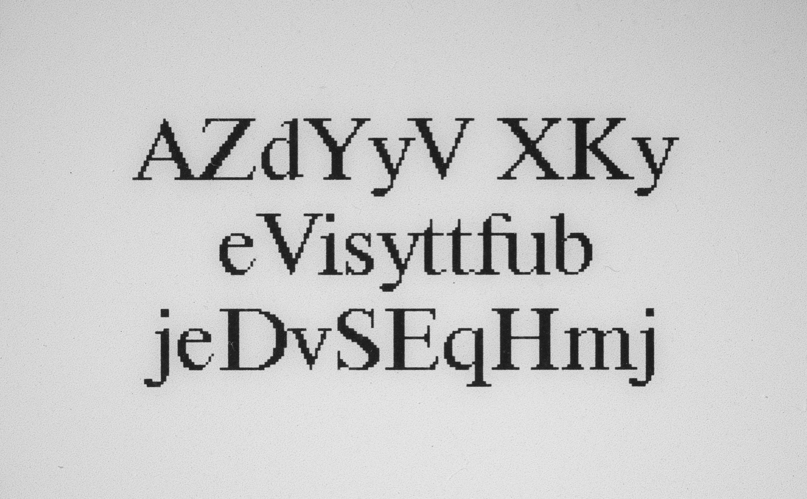

# Helsinki deblur challenge 2021

## Authors, institution, location

* André Kazuo Takahata¹ - andre.t@ufabc.edu.br
* Leonardo Ferreira Alves¹ - leonardo.alves@ufabc.edu.br
* Ricardo Suyama¹ - ricardo.suyama@ufabc.edu.br
* Roberto Gutierrez Beraldo¹ - roberto.gutierrez@ufabc.edu.br

¹Federal University of ABC (Santo André, São Paulo, Brazil) - https://www.ufabc.edu.br/

## Brief description of your algorithm and a mention of the competition.
The identification of alphanumeric characters depends on the quality of the image obtained. For images with blur caused by lack of focus, it is necessary to restore it to a sharper image, the so-called deblurring task. In this work, we used convolutional neural networks to deblur images from the 

Helsinki Deblur Challenge 2021 (HDC2021, https://www.fips.fi/HDC2021.php).

A

### Forward problem
We consider the forward problem, i.e., to blur the image, as the convolution of an image X with a Point Spread Function (PSF) K

where Y is the resulting blurred image.

While there is no explicit noise assumption, to simulate the out of focus blur the PSF is considered as a disc, where the only parameter is its radius. Inside the disc, the value is 1 and outside the disc the value is 0 [[2]](#1).. For each blur step (from 0 to 19), the PSF radius was visually estimated from the sharp-blurred image pairs.

The Blur category number is one of the three input arguments of the function. It is also important to select the correct image folder. 

### Inverse problem 
There are three steps to reconstruct the sharp images.

#### First step: Deep image prior (DIP)

What is necessary:
* network architeture, parameters and hyperparameters. 
* blurred images from the dataset

"randomly-initialized neural network can be used as a handcrafted prior" [[1]](#1).
we fit a generator network to a single degraded image. In this scheme, the network weights serve as a parametrization of the restored image. The weights are randomly initialized and fitted to a specific degraded image under a task-dependent observation model. In this manner, the only information used to perform reconstruction is contained in the single degraded input image and the handcrafted structure of the network used for reconstruction [[1]](#1)..

Adeep generator network is a parametric function  
that maps a code vector z to an image x [[1]](#1)..

 

#### Second step: autoencoder
A

 

A

#### Third step: regularized DIP

A

## Installation instructions, including any requirements.
In this repository there are 3 files available, one for each step.
At the same time, there are Google Colab notebooks 

## Usage instructions.

## Show a few examples.

## References
<a id="1">[1]</a> 
D. Ulyanov, A. Vedaldi, and V. Lempitsky.
“Deep image prior” International Journal of Computer Vision, vol. 128, no. 7, pp.1867–1888, Mar. 2020. [Online]. Available: https://doi.org/10.1007/s11263-020-01303-4

<a id="2">[2]</a> 
C.   P.   Hansen,   G.   Nagy,   and   D.   P.   O’Leary.,Deblurring   images:   matrices,   spectra,   and   filtering. Philadelphia:   SIAM,   Societyfor  Industrial  and  Applied  Mathematics,  2006.  [Online].  Available:http://www.imm.dtu.dk/∼pcha/HNO
